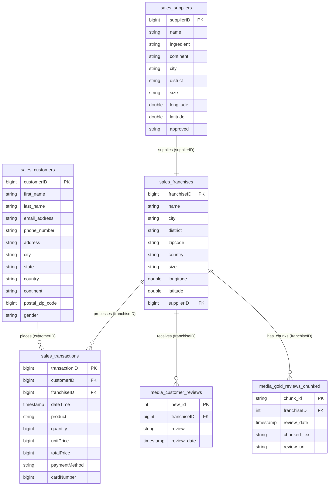

# Bakehouse Dataset Documentation

The Bakehouse Dataset simulates a bakery franchise business and contains several key datasets for various analytical and AI-driven use cases. Please note that this sample dataset has been synthetically curated and is suitable for any Databricks workload.

Sample use cases for this dataset include:

- **Building Data Pipelines with Delta Live Tables:** Create automated, real-time data pipelines for efficient data ingestion, transformation, and management.
- **Performing Analytics with Databricks SQL:** Conduct powerful SQL-based analytics to uncover actionable insights from structured data, including sales trends and customer behavior.
- **Exploring AI and Machine Learning Capabilities:** Use the dataset to develop and train machine learning models, applying AI to forecast trends, optimize operations, and predict customer preferences.

---

## 📋 Schema Details

### 1. `samples.bakehouse.sales_customers`

| Column | Type | Description |
| -- | -- | -- |
| `customerID` | bigint | รหัสประจำตัวลูกค้า (Primary Key) |
| `first_name` | string | ชื่อ |
| `last_name` | string | นามสกุล |
| `email_address` | string | อีเมล |
| `phone_number` | string | เบอร์โทรศัพท์ |
| `address` | string | ที่อยู่ |
| `city` | string | เมือง |
| `state` | string | รัฐ / จังหวัด |
| `country` | string | ประเทศ |
| `continent` | string | ทวีป |
| `postal_zip_code` | bigint | รหัสไปรษณีย์ |
| `gender` | string | เพศ |

### 2. `samples.bakehouse.sales_franchises`

| Column | Type | Description |
| -- | -- | -- |
| `franchiseID` | bigint | รหัสสาขาแฟรนไชส์ (Primary Key) |
| `name` | string | ชื่อสาขา |
| `city` | string | เมืองที่ตั้งสาขา |
| `district` | string | เขต/อำเภอ |
| `zipcode` | string | รหัสไปรษณีย์ |
| `country` | string | ประเทศ |
| `size` | string | ขนาดสาขา (เช่น Small, Medium, Large) |
| `longitude` | double | พิกัดลองจิจูด |
| `latitude` | double | พิกัดละติจูด |
| `supplierID` | bigint | รหัสซัพพลายเออร์ที่ส่งวัตถุดิบ (Foreign Key) |

### 3. `samples.bakehouse.sales_suppliers`

| Column | Type | Description |
| -- | -- | -- |
| `supplierID` | bigint | รหัสซัพพลายเออร์ (Primary Key) |
| `name` | string | ชื่อบริษัท/ผู้จัดส่ง |
| `ingredient` | string | ประเภทวัตถุดิบหลักที่จัดส่ง |
| `continent` | string | ทวีป |
| `city` | string | เมืองที่ตั้งซัพพลายเออร์ |
| `district` | string | เขต/อำเภอ |
| `size` | string | ขนาดองค์กร |
| `longitude` | double | พิกัดลองจิจูด |
| `latitude` | double | พิกัดละติจูด |
| `approved` | string | สถานะการอนุมัติ (YES / NO) |

### 4. `samples.bakehouse.sales_transactions`

| Column | Type | Description |
| -- | -- | -- |
| `transactionID` | bigint | รหัสธุรกรรมการขาย (Primary Key) |
| `customerID` | bigint | รหัสลูกค้าผู้ซื้อ (Foreign Key) |
| `franchiseID` | bigint | รหัสสาขาที่เกิดรายการขาย (Foreign Key) |
| `dateTime` | timestamp | วันและเวลาที่เกิดธุรกรรม |
| `product` | string | ชื่อสินค้าที่ซื้อ |
| `quantity` | bigint | จำนวนชิ้นที่ซื้อ |
| `unitPrice` | bigint | ราคาต่อหน่วย |
| `totalPrice` | bigint | ราคารวม |
| `paymentMethod` | string | ช่องทางการชำระเงิน (เช่น Credit Card, Cash) |
| `cardNumber` | bigint | หมายเลขบัตร (แบบปิดบัง) |

### 5. `samples.bakehouse.media_customer_reviews`

| Column | Type | Description |
| -- | -- | -- |
| `new_id` | int | รหัสรีวิว (Primary Key) |
| `review` | string | ข้อความรีวิว/ความคิดเห็นจากลูกค้า |
| `franchiseID` | bigint | รหัสสาขาที่ถูกรีวิว (Foreign Key) |
| `review_date` | timestamp | วันเวลาที่รีวิว |

### 6. `samples.bakehouse.media_gold_reviews_chunked`

| Column | Type | Description |
| -- | -- | -- |
| `chunk_id` | string | รหัสประจำ Chunk ของข้อความ (Primary Key) |
| `franchiseID` | int | รหัสสาขาที่ถูกรีวิว (Foreign Key) |
| `review_date` | timestamp | วันเวลาที่รีวิว |
| `chunked_text` | string | ข้อความรีวิวส่วนย่อย (Text Chunk) |
| `review_uri` | string | URI อ้างอิงไฟล์ข้อความต้นฉบับ |

## 🔗 อธิบายความสัมพันธ์ของแต่ละตาราง (Table Relationships Explanation)

1. **`sales_customers` 🔗 `sales_transactions` (1-to-N):**
   - **Key:** `sales_customers.customerID` = `sales_transactions.customerID`
   - **ความสัมพันธ์:** ลูกค้า 1 คน (One) สามารถสร้างคำสั่งซื้อหรือทำธุรกรรมการซื้อสินค้าได้หลายรายการ (Many)

2. **`sales_franchises` 🔗 `sales_transactions` (1-to-N):**
   - **Key:** `sales_franchises.franchiseID` = `sales_transactions.franchiseID`
   - **ความสัมพันธ์:** สาขาเบเกอรี่ 1 สาขา (One) สามารถประมวลผลและทำรายการขายได้หลายรายการ (Many)

3. **`sales_suppliers` 🔗 `sales_franchises` (1-to-1):**
   - **Key:** `sales_suppliers.supplierID` = `sales_franchises.supplierID`
   - **ความสัมพันธ์:** ซัพพลายเออร์วัตถุดิบ 1 ราย (One) สามารถจัดส่งวัตถุดิบให้กับสาขาแฟรนไชส์ได้ 1 สาขา (One)

4. **`sales_franchises` 🔗 `media_customer_reviews` (1-to-N):**
   - **Key:** `sales_franchises.franchiseID` = `media_customer_reviews.franchiseID`
   - **ความสัมพันธ์:** สาขาเบเกอรี่ 1 สาขา (One) สามารถได้รับข้อติชม/รีวิวจากลูกค้าได้หลายข้อความ (Many)

5. **`sales_franchises` 🔗 `media_gold_reviews_chunked` (1-to-N):**
   - **Key:** `sales_franchises.franchiseID` = `media_gold_reviews_chunked.franchiseID`
   - **ความสัมพันธ์:** สาขาเบเกอรี่ 1 สาขา (One) มีข้อมูลรีวิวที่ถูกตัดแบ่งชิ้นส่วนข้อความ (Chunked Text) หลายชิ้นส่วน สำหรับใช้ในงานประมวลผลภาษาธรรมชาติ (NLP / LLM) และ Vector Search

```sql
select
  franchiseID,
  count(supplierID) as cnt
from
  samples.bakehouse.sales_franchises
group by
  franchiseID
order by
  cnt
limit 100;
```

---

---

## 📐 Entity-Relationship Diagram (ER Diagram)


